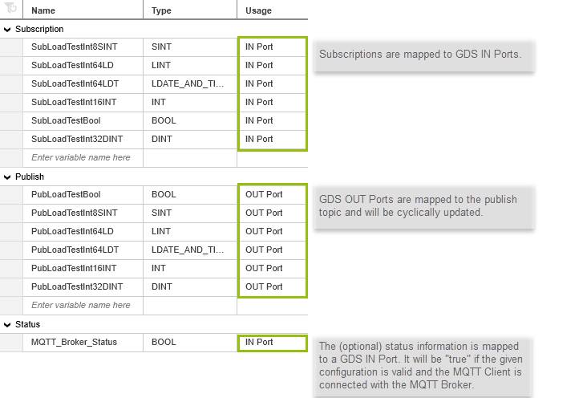

# PLCnext Technology - MQTT GDS Connector

[](https://github.com/PLCnext/MqttGdsConnector/issues?q=is%3Aopen+is%3Aissue+label%3Afeature-request+sort%3Areactions-%2B1-desc)
[](https://github.com/PLCnext/MqttGdsConnector/issues?utf8=✓&q=is%3Aissue+is%3Aopen+label%3Abug)
[](LICENSE)
[](https://www.phoenixcontact.com/plcnext)
[](https://www.plcnext-community.net)

**THIS PROJECT IS NO LONGER MAINTAINED**, either in Github or in the PLCnext Store.

For examples of how to develop [ACF Components](https://www.plcnext.help/te/Programming/Cpp/Cpp_program_structure/ACF_Application_Component_Framework.htm) for the PLCnext Runtime, please see the [C++ Examples](https://github.com/PLCnext/CppExamples) repository on Github. That repository includes many examples of how to use the RSC services that are published by the PLCnext Runtime.

For MQTT Client solutions on a PLCnext Control device, please search the [PLCnext Store](https://www.plcnextstore.com) for suitable apps.

<hr>

| Date       | Version | Authors                     |
|------------|---------|-----------------------------|
| 06.12.2019 | 1.2.0   | Martin Boers<br>Frank Walde |


## Description

MQTT GDS Connector is a PLCnext Technology component that exchanges data between Global Data Space (GDS) ports and MQTT server topics.



The component is configured with the file `mqtt_gds.settings.json` which is stored locally on the device.

```json
{ "brokers":[{
    "host": "tcp://test.mosquitto.org:1883",
    "client_name": "MQTT_Test_App",
	"status_port": "Arp.Plc.Eclr/TestBench1.MQTT_Broker_Status",
    "connect_options":{
      "will_options":{
        "topic": "last_will_topic",
        "payload": "auf wiedersehen"
      }
    },
    "publish_on_change": true,
    "cycle_count_port": "Arp.Plc.Eclr/TestBench1.CycleCount",
    "publish_data":[{
      "port"   : "Arp.Plc.Eclr/TestBench1.PubLoadTestBool",
      "qos": 0,
      "retained": false,
      "topics" :[
        "LoadTestBool"
      ]
    }
],
    "subscribe_data":[{
      "topic" : "LoadTestBool",
      "ports" :[
        "Arp.Plc.Eclr/TestBench1.SubLoadTestBool"
      ]
    }
]
  }]
}
```

The entries in this file must conform to the defined JSON schema (please refer for more details the "configuration reference" section below).

**Note:** Every invalid configuration (invalid schema or missing mandatory field) leads to a stop of the app. Debug information will appear in the Output.log file of the PLC: `/opt/plcnext/logs/Output.log`


## Requirements

* AXC F 2152 with minimum firmware version 2020.0 LTS
* Valid account for the PLCnext Store with payment credentials (not needed for the trial version)
* The PLCnext Control must be connected to the internet and must be registered in the PLCnext Store

## Features

* The MQTT Client app is compatible with MQTT version 3.1 and 3.1.1
* Support of TCP and Websockets over an unencrypted or an encrypted (SSL/TLS) connection
* Automatic reconnect to the MQTT Broker
* Easy handling due to GDS port mapping, no further configuration effort
* Publish data on change or, alternatively, cyclic update of Publish Topics, individually adjustable (minimum 500ms)
* Support of the following data types\* (Bool, Int8, Int16, Int32, Int64, Uint8, Uint16, Uint32, Uint64, Real32, Real64, String\*\*, DateTime)
* Publish topics on a fixed update rate or on change

*\*The named data types are C++ types. Please refer the PLCnext Technology Handbook (available in the [PLCnext Community](https://www.plcnext-community.net/index.php?option=com_wrapper&view=wrapper&Itemid=353&lang=en)) for the corresponding IEC 61131-3 or Matlab<sup>&trade;</sup> Simulink data types.*  
**\*String data is always published with a terminating NULL character. When subscribing to String data, incoming message payloads must always include a terminating NULL character.*


## Contributing

Contributions to this project are welcome.

## Building from source

Building from source requires the PLCnext SDK for your target. It is strongly recommended that you use the PLCnext Command Line Interface (CLI) to install and manage PLCnext SDKs on your host. Assistance with this is available from the [PLCnext Community]((https://plcnext-community.net)).

An example of a build session is as follows:

```
$ git clone https://github.com/PLCnext/MqttGdsConnector
$ cd MqttGdsConnector
$ cmake -G "Ninja" 
> -DCMAKE_TOOLCHAIN_FILE=/opt/pxc/sdk/AXCF2152/2019.3/toolchain.cmake
> -DBUILD_TESTING=OFF
> -DUSE_ARP_DEVICE=ON
> -DCMAKE_STAGING_PREFIX=/home/tcs-user/Documents/projects/MqttGdsConnector/bin/axcf2152
> -DCMAKE_INSTALL_PREFIX=/usr/local
> -DCMAKE_PREFIX_PATH=/home/tcs-user/Documents/projects/MqttGdsConnector/external/deploy/axcf2152
> -DCMAKE_EXPORT_COMPILE_COMMANDS=ON
> -DARP_TOOLCHAIN_ROOT=/opt/pxc/sdk/AXCF2152/2019.3
> -DARP_DEVICE=AXCF2152 "-DARP_DEVICE_VERSION=2019.9 (19.9.0.23151  )"
> -S . -B ./build/axcf2152-2019.3
$ cmake --build /home/tcs-user/Documents/projects/MqttGdsConnector/build/axcf2152-2019.3 --config Debug --target all -- -j 3
$ cmake --build /home/tcs-user/Documents/projects/MqttGdsConnector/build/axcf2152-2019.3 --config Debug --target install -- -j 3
```

## Installing manually
**Note:** The following steps are only needed when you build the application from source without using the PLCnext Store. Phoenix Contact recommend the usage of the PLCnext Store.

**Note:** The MQTT GDS Connector uses the Remote Service Call (RSC) service published by the MQTT Client component, which must be running on the target.
When the MQTT Client app is deployed via the PLCnext Store, this RSC service is automatically deployed and loaded.

1. Copy the contents of `external/deploy/axcf2152` to `/usr/local` on the target.
1. Copy `libGdsConnector.so` to `/usr/local/lib` on the target.
1. Copy `libs/MqttGdsConnector.acf.config` to `/opt/plcnext/projects/Default` on the target.
1. Copy the file `mqtt_gds.schema.json` to `/opt/plcnext/apps/60002172000048/` on the target.
1. Copy a valid configuration file named `mqtt_gds.settings.json` to `/opt/plcnext/projects/MqttClient` on the target.
1. Reboot the target.

## Quick start

This example exchanges data between a PLC (MQTT Client) and an iPhone* or iPad* (both MQTT Clients) via a public MQTT broker, over an unencrypted connection. It requires a PLC that is connected to the internet, and a PC with access to both the PLC and the internet. For this example, the PC must have PLCnext Engineer software installed.

**This is only an example. There are many other free MQTT Test Clients for Android, Windows or Linux available*

1. Make sure that your AXC F 2152 runs on [firmware](https://www.phoenixcontact.com/qr/2404267/firmware) version >=2019.9, and that it has access to the Internet.
1. Register for a user account and authorize your AXC F 2152 in the [PLCnext Store](https://www.plcnextstore.com).
1. Deploy the app via the PLCnext Store.
1. Create an IEC 61131 project in PLCnext Engineer with the following configuration:
  - one AXC F 2152 PLC with the template version >=2019.0 LTS
  - one program called "Main"
  - one program OUT port called "PubMessage" of STRING type
  - one program IN port called "SubMessage" of STRING type
  - one instance of the Main program, called "MainInstance"
1. Download the PLCnext Engineer project to the PLC.
1. Go online to the PLC and change the value of the "PubMessage" variable in the "MainInstance" program instance.
1. Install the [MQTTool app](https://itunes.apple.com/us/app/mqttool/id1085976398) on an iPhone or iPad.
1. Open the MQTTool app and connect to the public Mosquitto test broker (test.mosquitto.org, port 1883).
1. On a PC, create a text file named `mqtt_gds.settings.json`, containing the following configuration:

   ```json
   {
     "brokers":[{
       "host": "tcp://test.mosquitto.org:1883",
       "client_name": "MyPLCnext",
       "connect_options":{
         "will_options":{
           "topic": "last_will_topic",
           "payload": "auf wiedersehen"
         }
       },
       "publish_data":[{
         "port"   : "Arp.Plc.Eclr/MainInstance.PubMessage",
         "qos"    : 0,
         "retained": false,
         "period": 10,
         "topics" :[
           "MyPubTopic"
         ]
       }],
       "subscribe_data":[{
         "topic" : "MySubTopic",
         "ports" :[
           "Arp.Plc.Eclr/MainInstance.SubMessage"
         ]
       }]
     }]
   }
   ```
   In the configuration file, change the `client_name` property to a value that is likely to be unique on a public server.

   Change the publish and subscribe `topic` properties to values that are likely to be unique on a public server.
1. Using WinSCP (Windows) or `scp` (Linux), copy the `mqtt_gds.settings.json` file to the following directory on the PLC: `/opt/plcnext/projects/MqttClient/`. Create this directory on the PLC if it does not exist already.

   The default login credentials for the PLC are:
   - User name : admin
   - Password  : &lt;printed on the PLC housing&gt;


1. Restart the PLC.
1. In the MQTTool app on the iPhone or iPad, subscribe to the topic name that was entered in the `publish_data` section of the configuration file (e.g. "MyPubTopic").
1. The messages received on the iPhone or iPad now show the value of the PubMessage variable in the PLC.
1. On the iPhone or iPad, publish a message to the topic that was entered in the `subscribe_data` section of the configuration file (e.g. "MySubTopic"). This message now appears as the value of the SubMessage variable in the PLC.

## "Publish on change" vs "Publish cyclically"

The app can be configured to publish port data using one of two methods:

1. Publish data only when the value of the data changes.

1. Publish data on a fixed period, regardless of whether there has been any change to the value of the data.

The first of these options is suitable for publishing data that does not change regularly. This may save on data transmission costs (e.g. on mobile data networks). This option is also suitable for event data, which may only need to be published once when the event occurs.

The second option provides behaviour that is similar to that of the Proficloud Time Series Data (TSD) service, where data is published on a fixed cycle regardless of whether the data has changed.

Note that when publishing "on change", changes are detected based on data samples taken every 500 ms (approximately). If the user wishes to publish data on a single topic at a faster rate than this, then the user must buffer the data (e.g. in an array), and feed the data into the published Port variable(s) at a rate not greater than the data sample rate. In order to assist with this, the MQTT Client app provides a `cycle_count_port` parameter (see configuration section below). If the `cycle_count_port` is specified in the configuration file, then the value of the `cycle_count_port` variable will be incremented by the MQTT Client app each time a data sample is taken for change detection. This variable can then be used as a "clock" for feeding data into the Publish ports. Note that the `cycle_count_port` variable will be incremented each time a data sample is taken, regardless of whether any change to the publish data is detected.

## Configuration reference

The MQTT GDS Client is configured with the file `mqtt_gds.settings.json`. This file must be located in the following directory on the PLC:

`/opt/plcnext/projects/MqttClient/`

This directory must be created on the PLC if it does not exist already.

For encrypted connections, a server certificate, client certificate and client private key may be required. These files should be copied to the PLC using WinSCP (Windows) or scp (Linux). The user is free to place these files anywhere on the PLC file system. The absolute path to these files must then be specified in the relevant `ssl_options` configuration fields.

All changes to the configuration will only take effect after a restart of the PLC.


### Configuration schema

The configuration file `mqtt_gds.settings.json` must comply with the JSON schema defined in the file `mqtt_gds.schema.json`. This schema file must be located in the following directory on the PLC:

`/opt/plcnext/apps/60002172000048/`

**Note:** Every invalid configuration (invalid configuration or missing mandatory field) leads to a stop of the app. Debug information will appear in the Output.log file of the PLC: `/opt/plcnext/logs/Output.log`


-----------
### Broker properties
A valid configuration consists of an array of MQTT Broker objects. Each broker object represents one MQTT client-broker connection.

**Note:** The MQTT Client version 1.x only supports one MQTT Broker connection.

Name              | Required | JSON type        | Description
:---              | :---     | :---             | :---
host              | Yes      | string           | The address of the server to connect to, specified as a URI.<sup>1</sup>
clientId          | Yes      | string           | A client identifier that is unique on the server being connected to.
status_port       | No       | string           | The name of a boolean GDS port that will receive the client connection status.<sup>2</sup>
connect_options   | Yes      | object           | The connection options. See table below.
publish_on_change | No       | boolean          | Publish all variables on change (false/default: publish on a fixed period).<sup>3</sup>
cycle_count_port  | No       | string           | The name of a UInt64 GDS port which can receive a monotonically increasing integer.<sup>2,4</sup>.
publish_data      | No       | array of objects | MQTT publish information. See table below.
subscribe_data    | No       | array of objects | MQTT subscribe information. See table below.

**Note:**
1. The host _must_ be specified in the following format:

   *protocol://host:port*

   ... where *protocol* must be *tcp*, *ssl*, *ws* or *wss*. If nothing is specified, *tcp* is assumed. For *host*, you can specify either an IP address or a domain name.

1. Ports on PLCnext Engineer programs must be specified in the following format:

   *Arp.Plc.Eclr/ProgramInstance.PortName*

   ... where *ProgramInstance* must be the name of the program instance in the PLCnext Engineer project, and *PortName* must the name of a port variable defined in that program.

1. The `publish_on_change` switch applies to all published variables, i.e. all variables must be published either on change, or on fixed period(s).
The maximum publish frequency remains at 2 Hz (i.e. 500 ms period).

1. To assist with the "Publish On Change" feature, users can configure a GDS port to receive an integer that increments after each publish cycle. This `cycle_count_port` value can be used as a clock to feed messages into GDS variables from a buffer, if necessary.

-----------
#### connect_options

Name                | Required | JSON type | Default value | Description
:---                | :---     | :---      | :---          | :---
username            | No       | string    | NULL          | The user name to use for the connection.
password            | No       | string    | NULL          | The password to use for the connection.
mqtt_version        | No       | integer   | 0             | The version of MQTT to be used on the connect.<sup>1</sup>
will_options        | Yes      | object    |               | The LWT options to use for the connection. See table below.
ssl_options         | No       | object    |               | The SSL options to use for the connection. See table below. 

**Note:**
1. mqtt_version:
   - 0 = default: start with 3.1.1, and if that fails, fall back to 3.1
   - 3 = only try version 3.1
   - 4 = only try version 3.1.1
1. LWT = Last Will Topic
-----------
#### will_options

Name     | Required | JSON type | Description
:---     | :---     | :---      | :---
topic    | Yes      | string    | The LWT message is published to the this topic.
payload  | Yes       | string    | The message that is published to the Will Topic.
qos      | No       | integer   | The message Quality of Service.
retained | No       | boolean   | Tell the broker to keep the LWT message after sent to subscribers.

-----------
#### ssl_options
The ssl option is only needed when encrypted *ssl* communication is used. Depending on the MQTT Broker policies, different configurations may be needed.

Name                    | Required | JSON type | Description
:---                    | :---     | :---      | :---
trust_store             | Yes       | string    | The filename containing the public digital certificates trusted by the client.
key_store               | No       | string    | The filename containing the public certificate chain of the client.
private_key             | No       | string    | The filename containing the client's private key.
private_key_password    | No       | string    | The password to load the client's privateKey (if encrypted).
enabled_cipher_suites   | No       | string    | The list of cipher suites that the client will present to the server during the SSL handshake.
enable_server_cert_auth | No       | boolean   | Enable verification of the server certificate.

#### Broker configuration example
The following examples show two broker configurations. One is a simple unencrypted connection to the Mosquitto MQTT test broker and the other is an encrypted connection.

   ```json
{ "brokers":[{
    "host": "tcp://test.mosquitto.org:1883",
    "client_name": "MQTT_Test_App",
	"status_port": "Arp.Plc.Eclr/TestBench1.MQTT_Broker_Status",
    "connect_options":{
      "will_options":{
        "topic": "last_will_topic",
        "payload": "auf wiedersehen"
      }
  }]
}
```
*Configuration example for an unencrypted connection*

   ```json
{ "brokers":[{
    "host": "ssl://test.mosquitto.org:8883",
    "client_name": "MQTT_Test_App",
	"status_port": "Arp.Plc.Eclr/TestBench1.MQTT_Broker_Status",
    "connect_options":{
      "will_options":{
        "topic": "last_will_topic",
        "payload": "auf wiedersehen"
      },
	"ssl_options":
    {
            "trust_store": "/opt/plcnext/projects/MqttClient/mosquitto.org.crt",
            "key_store": "/opt/plcnext/projects/MqttClient/client.crt",
            "private_key": "/opt/plcnext/projects/MqttClient/client.key",
            "private_key_password": "dont_tell",
            "enabled_cipher_suites": "",
            "enable_server_cert_auth": true

       }
    }
  }]
}
```
*Configuration example for an encrypted connection*```

-----------
### publish_data

Publish_data must be an array of objects with the following properties:

Name     | Required | JSON type        | Description
:---     | :---     | :---             | :---
port     | Yes      | string           | The 'OUT' port from which data will be published<sup>1</sup>.
period   | No       | integer          | The publish frequency in seconds (max 86,400). If not specified, period=500ms.
qos      | Yes      | integer          | The message Quality of Service<sup>2</sup>.
retained | Yes      | boolean          | Tell the broker to keep messages after send to subscribers<sup>3</sup>.
topics   | Yes      | array of strings | Message are published to all these topics.

**Note:**
1. Ports published from PLCnext Engineer projects must be specified in the following format:

   *Arp.Plc.Eclr/ProgramInstance.PortName*

   ... where *ProgramInstance* must be the name of the program instance in the PLCnext Engineer project, and *PortName* must the name of an OUT port variable defined in that program.
1. The MQTT app version 1.x only supports QoS 0
1. The MQTT app version 1.x does not support 'retained'.

#### publish_data configuration example
The following example shows a valid configuration.

**Note:** Make sure that the assigned GDS port exists and that the data type is correct. An incorrect configuration will prevent the app from starting.

   ```json
    "publish_on_change": true,
    "cycle_count_port": "Arp.Plc.Eclr/TestBench1.CycleCount",
    "publish_data":[{
      "port"   : "Arp.Plc.Eclr/TestBench1.PubLoadTestBool",
      "qos": 0,
      "retained": false,
      "topics" :[
        "LoadTestBool"
      ]
    }
```


-----------
### subscribe_data

subscribe_data must be an array of objects with the following properties:

Name     | Required | JSON type        | Description
:---     | :---     | :---             | :---
topic    | Yes      | string           | This topic is subscribed Message are published to all these topics.
ports    | Yes      | array of strings | The 'IN' ports to which subscription data will be written<sup>1</sup>.

**Note:**
1. Ports in PLCnext Engineer projects that subscribe to MQTT topics must be specified in the following format:

   *Arp.Plc.Eclr/ProgramInstance.PortName*

   ... where *ProgramInstance* must be the name of the program instance in the PLCnext Engineer project, and *PortName* must the name of an IN port variable defined in that program.

#### subscribe_data configuration example
The following example shows a valid configuration.

**Note:** Make sure that the assigned GDS port exists and that the data type is correct. An incorrect configruation will prevent the app from starting.

   ```json
"subscribe_data":[{
      "topic" : "LoadTestBool",
      "ports" :[
        "Arp.Plc.Eclr/TestBench1.SubLoadTestBool"
      ]
    }
```

### Configuration examples
A complete configuration example can be found [here](https://github.com/PLCnext/MqttGdsConnector/tree/master/examples).  
Remember that your own configuration file must **always** be named `mqtt_gds.settings.json`.

-----------
## Note on operation in different PLC states

When the PLC goes into "Stop" mode, all PLCnext task processing will be suspended, but the MQTT Client will continue to run. GDS variables will continue to be read and written by the MQTT Client app. This is by design, because any or all GDS variables can be associated with processes that are not running in PLCnext tasks, e.g. other Function Extensions, or other Runtime applications.

## Known issues and limitations
* Only one client, and one concurrent server connection, is currently supported
* When the network connection to the broker is lost and restored, and a manual or automatic reconnect is triggered, the MQTT Client will block for precisely the number of milliseconds specified by the broker "timeout" property (default: 300 seconds).
* Complex data types (including Arrays and Structures) are not currently supported.
* Only QoS 0 is supported
* The app checks the assigned GDS port in terms of availability and type during the start-up process. Any changes to GDS ports (delete, rename or type) during operation (e.g. if a modified PLCnext Engineer project is downloaded without stopping the PLC) can lead to an undefined behaviour!

-----------
## Error handling 
The app logs the complete startup, connection and error history into the Output.log file (`/opt/plcnext/logs/Output.log`) of the PLC which gives the user a reliable indication of the current state of the app.
In addition, a status port can be configured (please refer the chapter 'broker properties'). The value *true* indicates that the app was successfully started (configuration correct) and that connection to the configured MQTT Broker could be established. The values goes to *false* when the app could not be started (wrong configuration) or when the connection to the MQTT Broker could not be established or is interrupted.

**Note:** Phoenix Contact strongly recommend the usage of the "status_port".

### Diagnostic Log
This chapter explains the most important diagnostic messages and is intended to support troubleshooting the MQTT app.

All diagnostics are printed in the output.log file (`/opt/plcnext/logs/Output.log`).

In the following is a positive start up of the app logged and described.

```
PxceTcs.Mqtt.GdsConnectorComponent    INFO  - Loaded configuration from file: /opt/plcnext/projects/MqttClient/mqtt_gds.settings.json  
PxceTcs.Mqtt.GdsConnectorComponent    INFO  - Loaded configuration schema.  
```
The configuration was loaded successfully, no schema violations were detected.

**Note:** Every schema violation (missing json separators or missing mandatory fields) will lead to an error at this position.
The message indicates the error type.

```
PxceTcs.Mqtt.GdsConnectorComponent    INFO  - No reconnect port has been specified.  
PxceTcs.Mqtt.GdsConnectorComponent    INFO  - Created MQTT Client with ID: 56022  
PxceTcs.Mqtt.GdsConnectorComponent    INFO  - No MQTT SSL/TLS Options provided. Defaults will be used.  
PxceTcs.MqttClient.MqttClientManager  INFO  - Connecting to MQTT server  
PxceTcs.MqttClient.MqttClientManager  INFO  - Connected  
PxceTcs.Mqtt.GdsConnectorComponent    INFO  - Connected to MQTT Client 56022
```
After the configuration was loaded, generates the MQTT client a random client ID and tries to connect with the defined MQTT Broker.

**Note:** Connection or certification problems will lead to an error at this position.

```
PxceTcs.Mqtt.GdsConnectorComponent    INFO  - Subscribed to MQTT topic LoadTestBool  
PxceTcs.Mqtt.GdsConnectorComponent    INFO  - Subscribed to MQTT topic LoadTestBool1  
PxceTcs.Mqtt.GdsConnectorComponent    INFO  - SetupConfig(): Worker thread has been started. 
```
As soon as the connection is valid, the MQTT Client will start to publish and subscribe the configured topics.
The cyclic update is performed with a worker thread (500ms). The app is now running.


## How to get support
The MQTT Client app is supported in the forum of the [PLCnext Community](https://www.plcnext-community.net/forum/#/categories).
Please raise an issue with a detailed error description and always provide a copy of the Output.log file.

-----------

Copyright © 2019 Phoenix Contact Electronics GmbH

All rights reserved. This program and the accompanying materials are made available under the terms of the [MIT License](http://opensource.org/licenses/MIT) which accompanies this distribution.

-----------

This code uses:

1. [JSON for Modern C++](https://github.com/nlohmann/json)

   Copyright (c) 2013-2019 [Niels Lohmann](nlohmann.me)

   Licensed under the [MIT License](http://opensource.org/licenses/MIT) which accompanies this distribution.

   The class contains the UTF-8 Decoder from Bjoern Hoehrmann which is licensed under the [MIT License](http://opensource.org/licenses/MIT) (see above). Copyright © 2008-2009 [Björn Hoehrmann](http://bjoern.hoehrmann.de/) bjoern@hoehrmann.de

   The class contains a slightly modified version of the Grisu2 algorithm from Florian Loitsch which is licensed under the [MIT License](http://opensource.org/licenses/MIT) (see above). Copyright © 2009 [Florian Loitsch](http://florian.loitsch.com/)

1. [valijson](https://github.com/tristanpenman/valijson)

   Copyright (c) 2016, Tristan Penman

   Copyright (c) 2016, Akamai Technolgies, Inc.
   
   All rights reserved.

   Licensed under the [Simplified BSD License](https://opensource.org/licenses/bsd-license) which accompanies this distribution.
