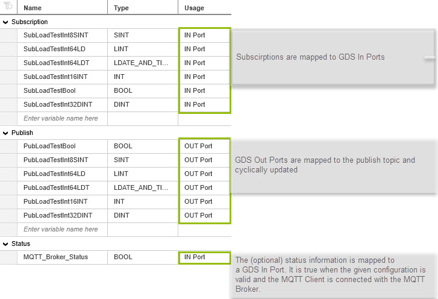

# PLCnext Technology - MQTT GDS Connector

[](https://github.com/PLCnext/mqtt_gds_connector/issues?q=is%3Aopen+is%3Aissue+label%3Afeature-request+sort%3Areactions-%2B1-desc)
[](https://github.com/PLCnext/mqtt_gds_connector/issues?utf8=✓&q=is%3Aissue+is%3Aopen+label%3Abug)
[](LICENSE)
[](https://www.phoenixcontact.com/plcnext)
[](https://www.plcnext-community.net)

| Date       | Version | Author       |
|------------|---------|--------------|
| 02.05.2019 | 1.1.0   | Martin Boers |


## Description

MQTT GDS Connector is a PLCnext Technology component, that exchanges data between Global Data Space (GDS) ports and MQTT server topics. 



The component is configured with the file `mqtt_gds.settings.json` which is stored localy on the device. 

```json
{ "brokers":[{
    "host": "tcp://test.mosquitto.org:1883",
    "client_name": "MQTT_Test_App",
	"status_port": "Arp.Plc.Eclr/TestBench1.MQTT_Broker_Status",
    "connect_options":{
      "will_options":{
        "topic": "last_will_topic",
        "payload": "auf wiedersehen"
      }
    },
    "publish_data":[{
      "port"   : "Arp.Plc.Eclr/TestBench1.PubLoadTestBool",
      "qos": 0,
      "retained": false,
      "topics" :[
        "LoadTestBool"
      ]
    }
],
    "subscribe_data":[{
      "topic" : "LoadTestBool",
      "ports" :[
        "Arp.Plc.Eclr/TestBench1.SubLoadTestBool"
      ]
    }
]
  }]
}
```

The entries in this file must conform to the defined JSON schema. Ff not will the app not start and post an error desciption in the output.log file which can be found in the following directory on the device.

/opt/plcnext/logs/output.log

The MQTT GDS Connector uses the Remote Service Call (RSC) service published by the MQTT Client component, which must be running on the target. 


## Requirements

* AXC F 2152 with minimum firmware version 2019.3
* Valid account for the PLCnext Store with payment credentials (not needed for the trial version)
* The PLCnext Control must be connected to the internet and must be registered in the PLCnext Store

## Features

* The MQTT Client app is compatible with version 3.1 and 3.1.1
* Support of TCP and Websockets over an unencrypted or an encrypted (SSL/TLS) connection
* Automatic reconnect to the MQTT Broker
* Easy handling due to GDS port mapping, no further configuration effort
* Cyclic update of Publish Topics, individually adjustable (minimum 500ms)
* Support of the following data types (Bool, Int8, Int16, Int32, Int64, Uint8, Uint16, Uint32, Uint64, Real32, Real64, String*, DateTime)


**String data is always published with a terminating NULL character. When subscribing to String data, incoming message payloads must always include a terminating NULL character.*


## Contributing

Contributions to this project are welcome.

## Building from source

Building from source requires the PLCnext SDK for your target. It is strongly recommended that you use the PLCnext Command Line Interface (CLI) to install and manage PLCnext SDKs on your host. Assistance with this is available from the [PLCnext Community]((https://plcnext-community.net)).

An example of a build session is as follows:

```
$ git clone https://github.com/PLCnext/MqttGdsConnector
$ cd MqttGdsConnector
$ cmake -G "Ninja" 
> -DCMAKE_TOOLCHAIN_FILE=/opt/pxc/sdk/AXCF2152/2019.3/toolchain.cmake
> -DBUILD_TESTING=OFF
> -DUSE_ARP_DEVICE=ON
> -DCMAKE_STAGING_PREFIX=/home/tcs-user/Documents/projects/MqttGdsConnector/bin/axcf2152
> -DCMAKE_INSTALL_PREFIX=/usr/local
> -DCMAKE_PREFIX_PATH=/home/tcs-user/Documents/projects/MqttGdsConnector/external/deploy/axcf2152
> -DCMAKE_EXPORT_COMPILE_COMMANDS=ON
> -DARP_TOOLCHAIN_ROOT=/opt/pxc/sdk/AXCF2152/2019.3
> -DARP_DEVICE=AXCF2152 "-DARP_DEVICE_VERSION=2019.3 (19.3.0.18161)"
> -S . -B ./build/axcf2152-2019.3
$ cmake --build /home/tcs-user/Documents/projects/MqttGdsConnector/build/axcf2152-2019.3 --config Debug --target all -- -j 3
$ cmake --build /home/tcs-user/Documents/projects/MqttGdsConnector/build/axcf2152-2019.3 --config Debug --target install -- -j 3
```

## Installing manualy
**Note** The follwoing steps are only needed when you build the application by yourself without using the PLCnext Store. Phoenix Contact recommend the usage of the PLCnext Store.


1. Copy the contents of `external/deploy/axcf2152` to `/usr/local` on the target.
1. Copy `libGdsConnector.so` to `/usr/local/lib` on the target.
1. Copy `libs/MqttGdsConnector.acf.config` to `/opt/plcnext/projects/Default` on the target.
1. Copy the file `mqtt_gds.schema.json` to `/opt/plcnext/apps/60002172000048/` on the target.
1. Copy a valid configuration file named `mqtt_gds.settings.json` to `/opt/plcnext/projects/MqttClient` on the target.
1. Reboot the target.

## Quick start

This example exchanges data between a PLC (MQTT Client) and an iPhone* or iPad* (both MQTT Clients) via a public MQTT broker, over an unencrypted connection. It requires a PLC that is connected to the internet, and a PC with access to both the PLC and the internet. For this example, the PC must have PLCnext Engineer software installed.

**There are many other free MQTT Test Clients for Android, Windows or Linux available*


1. Make sure that your AXC F 2152 has a firmware >=2019.3 and that it has an internet connection
1. Register yourself and your AXC F 2152 in the PLCnext Store (www.plcnextstore.com) - not necessary when the app is installed manualy
1. Deploy the app via the PLCnext Store (recommend) or manualy
1. Create an IEC 61131 project in PLCnext Engineer version 2019.3, with the following configuration:
   - One AXC F 2152 PLC with firmware version >=2019.0
   - one program called "Main"
   - one program OUT port called "PubMessage" of type STRING
   - one program IN port called "SubMessage" of type STRING
   - one instance of the Main program, called "MainInstance"
1. Download the PLCnext Engineer project to the PLC.
1. Go online to the PLC and change the value of the "PubMessage" variable in the "MainInstance" program instance.
1. Install the [MQTTool app](https://itunes.apple.com/us/app/mqttool/id1085976398) on an iPhone or iPad.
1. Open the MQTTool app and connect to the public Mosquitto test broker (test.mosquitto.org, port 1883).
1. On a PC, create a text file named `mqtt_gds.settings.json`, containing the following configuration:

   ```json
   {
     "brokers":[{
       "host": "tcp://test.mosquitto.org:1883",
       "client_name": "MyPLCnext",
       "connect_options":{
         "will_options":{
           "topic": "last_will_topic",
           "payload": "auf wiedersehen"
         }
       },
       "publish_data":[{
         "port"   : "Arp.Plc.Eclr/MainInstance.PubMessage",
         "qos"    : 0,
         "retained": false,
         "topics" :[
           "MyPubTopic"
         ]
       }],
       "subscribe_data":[{
         "topic" : "MySubTopic",
         "ports" :[
           "Arp.Plc.Eclr/MainInstance.SubMessage"
         ]
       }]
     }]
   }
   ```
   In the configuration file, change the `client_name` property to a value that is likely to be unique on a public server.

   Change the publish and subscribe `topic` properties to values that are likely to be unique on a public server.
1. Using WinSCP (Windows) or `scp` (Linux), copy the `mqtt_gds.settings.json` file to the following directory on the PLC: `/opt/plcnext/projects/MqttClient/`. Create this directory on the PLC if it does not exist already.

   The default login credentials for the PLC are:
   - User name : admin
   - Password  : &lt;printed on the PLC housing&gt;


1. Restart the PLC.
1. In the MQTTool app on the iPhone or iPad, subscribe to the topic name that was entered in the `publish_data` section of the configuration file (e.g. "MyPubTopic").
1. The messages received on the iPhone or iPad now show the value of the PubMessage variable in the PLC.
1. On the iPhone or iPad, publish a message to the topic that was entered in the `subscribe_data` section of the configuration file (e.g. "MySubTopic"). This message now appears as the value of the SubMessage variable in the PLC.


## Configuration reference

The MQTT GDS Client is configured with the file `mqtt_gds.settings.json`. This file must be located in the following directory on the PLC:

`/opt/plcnext/projects/MqttClient/`

This directory must be created on the PLC if it does not exist already.

For encrypted connections, a server certificate, client certificate and client private key may be required. These files should be copied to the PLC using WinSCP (Windows) or scp (Linux). The user is free to place these files anywhere on the PLC file system. The absolute path to these files must then be specified in the relevant `ssl_options` configuration fields.

After modifying any of these files, the PLCnext Runtime must be restarted.


### Configuration file details

The configuration file `mqtt_gds.settings.json` must comply with the JSON schema defined in the file `mqtt_gds.schema.json`. This schema file must be located in the following directory on the PLC:

`/opt/plcnext/apps/60002172000048/`

A valid configuration consists of an array of broker objects. Each broker object represents one MQTT client-broker connection.

The following is a list of all available broker properties. Optional properties that do not appear in the configuration file will be given default values.

NOTE: If the application encounters any error during startup, then it will immediately stop. For example, any error in the configuration, including missing GDS ports or GDS ports with unsupported types, will halt the application. In this case, check the Ouput.log file for a description of the error. After the error is corrected, the PLC must be restarted.

-----------
#### broker properties

Name            | Required | JSON type        | Description
:---            | :---     | :---             | :---
host            | Yes      | string           | The address of the server to connect to, specified as a URI.<sup>1</sup>
clientId        | Yes      | string           | A client identifier that is unique on the server being connected to.
timeout         | No       | integer          | Client timeout value in milliseconds (default: 300000, i.e. 300 seconds).
status_port     | No       | string           | The name of a boolean GDS port that will receive the client connection status.<sup>2</sup>
reconnect_port  | No       | string           | The name of a boolean GDS port that, on a rising edge, will trigger a reconnect attempt.<sup>2</sup>
connect_options | Yes      | object           | The connection options. See table below.
publish_data    | No       | array of objects | MQTT publish information. See table below.
subscribe_data  | No       | array of objects | MQTT subscribe information. See table below.

Notes:
1. The host _must_ be specified in the following format:

   *protocol://host:port*

   ... where *protocol* must be *tcp*, *ssl*, *ws* or *wss*. For *host*, you can specify either an IP address or a domain name.

1. Ports on PLCnext Engineer programs must be specified in the following format:

   *Arp.Plc.Eclr/ProgramInstance.PortName*

   ... where *ProgramInstance* must be the name of the program instance in the PLCnext Engineer project, and *PortName* must the name of a port variable defined in that program.

-----------
#### connect_options

Name                | Required | JSON type | Default value | Description
:---                | :---     | :---      | :---          | :---
keep_alive_interval | No       | integer   | 60            | The keep alive interval in seconds.
connect_timeout     | No       | integer   | 30            | The connect timeout in seconds.
username            | No       | string    | NULL          | The user name to use for the connection.
password            | No       | string    | NULL          | The password to use for the connection.
max_inflight        | No       | integer   | 0             | The maximum number of messages that can be in-flight simultaneously.
is_clean_session    | No       | boolean   | true          | Whether the server should remember state for the client across reconnects.
mqtt_version        | No       | integer   | 0             | The version of MQTT to be used on the connect.<sup>1</sup>
automatic_reconnect | No       | boolean   | false         | Enable or disable automatic reconnects.
min_retry_interval  | No       | integer   | 0             | The minimum retry interval in seconds. Doubled on each failed retry.
max_retry_interval  | No       | integer   | 0             | The maximum retry interval in seconds. The doubling stops here on failed retries.
will_options        | Yes      | object    |               | The LWT options to use for the connection. See table below.
ssl_options         | No       | object    |               | The SSL options to use for the connection. See table below. 

Note:
1. mqtt_version:
   - 0 = default: start with 3.1.1, and if that fails, fall back to 3.1
   - 3 = only try version 3.1
   - 4 = only try version 3.1.1

-----------
#### will_options

Name     | Required | JSON type | Description
:---     | :---     | :---      | :---
topic    | Yes      | string    | The LWT message is published to the this topic.
payload  | No       | string    | The message that is published to the Will Topic.
qos      | No       | integer   | The message Quality of Service.
retained | No       | boolean   | Tell the broker to keep the LWT message after send to subscribers.

-----------
#### ssl_options

Name                    | Required | JSON type | Description
:---                    | :---     | :---      | :---
trust_store             | No       | string    | The filename containing the public digital certificates trusted by the client.
key_store               | No       | string    | The filename containing the public certificate chain of the client.
private_key             | No       | string    | The filename containing the client's private key.
private_key_password    | No       | string    | The password to load the client's privateKey (if encrypted).
enabled_cipher_suites   | No       | string    | The list of cipher suites that the client will present to the server during the SSL handshake.
enable_server_cert_auth | No       | boolean   | Enable verification of the server certificate.

-----------
#### publish_data

publish_data must be an array of objects with the following properties:

Name     | Required | JSON type        | Description
:---     | :---     | :---             | :---
port     | Yes      | string           | The 'OUT' port from which data will be published<sup>1</sup>.
period   | No       | integer          | The publish frequency in seconds (max 86,400). If not specified, period=500ms.
qos      | Yes      | integer          | The message Quality of Service.
retained | Yes      | boolean          | Tell the broker to keep messages after send to subscribers.
topics   | Yes      | array of strings | Message are published to all these topics.

Note:
1. Ports published from PLCnext Engineer projects must be specified in the following format:

   *Arp.Plc.Eclr/ProgramInstance.PortName*

   ... where *ProgramInstance* must be the name of the program instance in the PLCnext Engineer project, and *PortName* must the name of an OUT port variable defined in that program.

-----------
#### subscribe_data

subscribe_data must be an array of objects with the following properties:

Name     | Required | JSON type        | Description
:---     | :---     | :---             | :---
topic    | Yes      | string           | This topic is subscribed Message are published to all these topics.
ports    | Yes      | array of strings | The 'IN' ports to which subscription data will be written<sup>1</sup>.

Note:
1. Ports in PLCnext Engineer projects that subscribe to MQTT topics must be specified in the following format:

   *Arp.Plc.Eclr/ProgramInstance.PortName*

   ... where *ProgramInstance* must be the name of the program instance in the PLCnext Engineer project, and *PortName* must the name of an IN port variable defined in that program.


### Configuration examples

Examples of configuration files that you can use as a starting point for your own project are available [here](https://github.com/PLCnext/MqttGdsConnector/tree/master/examples). Remember that your own configuration file must *always* be named `mqtt_gds.settings.json`.

## Error handling 
kommt noch

## Known issues and limitations
* Only one client, and one concurrent server connection, is currently supported
* When the network connection to the broker is lost and restored, and a manual or automatic reconnect is triggered, the MQTT Client will block for precisely the number of milliseconds specified by the broker "timeout" property (default: 300 seconds).
* Complex data types (including Arrays and Structures) are not currently supported.

-----------

Copyright © 2019 Phoenix Contact Electronics GmbH

All rights reserved. This program and the accompanying materials are made available under the terms of the [MIT License](http://opensource.org/licenses/MIT) which accompanies this distribution.

-----------

This code uses:

1. [JSON for Modern C++](https://github.com/nlohmann/json)

   Copyright (c) 2013-2019 [Niels Lohmann](nlohmann.me)

   Licensed under the [MIT License](http://opensource.org/licenses/MIT) which accompanies this distribution.

   The class contains the UTF-8 Decoder from Bjoern Hoehrmann which is licensed under the [MIT License](http://opensource.org/licenses/MIT) (see above). Copyright © 2008-2009 [Björn Hoehrmann](http://bjoern.hoehrmann.de/) bjoern@hoehrmann.de

   The class contains a slightly modified version of the Grisu2 algorithm from Florian Loitsch which is licensed under the [MIT License](http://opensource.org/licenses/MIT) (see above). Copyright © 2009 [Florian Loitsch](http://florian.loitsch.com/)

1. [valijson](https://github.com/tristanpenman/valijson)

   Copyright (c) 2016, Tristan Penman

   Copyright (c) 2016, Akamai Technolgies, Inc.
   
   All rights reserved.

   Licensed under the [Simplified BSD License](https://opensource.org/licenses/bsd-license) which accompanies this distribution.
